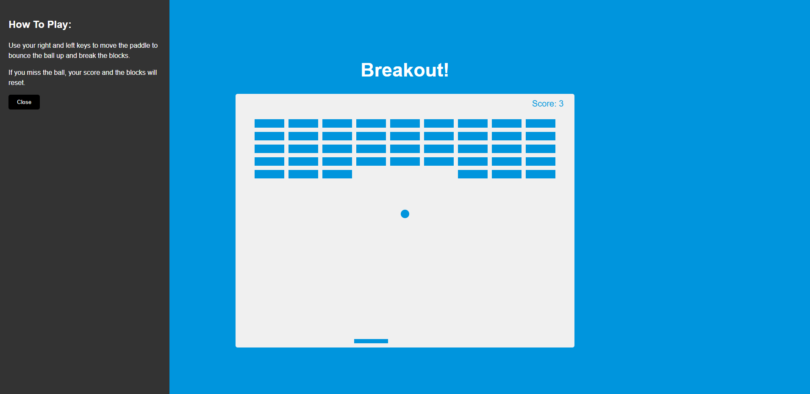
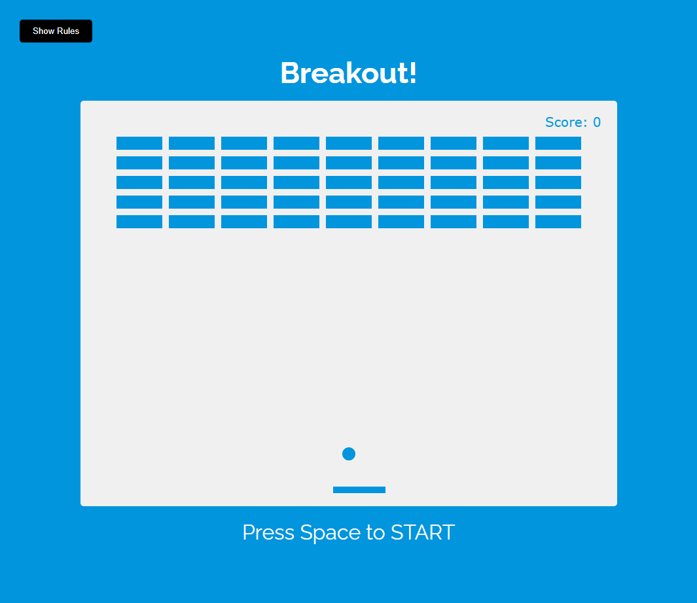

# Udemy--vanillawebprojects-17

**The seventeenth** in a series of **20 small projects** in **Vanilla JavaScript** from the [**Udemy course**](https://www.udemy.com/course/web-projects-with-vanilla-javascript/) by author [Brad Traversy](https://www.traversymedia.com/) with this [Brad's original GitHub repository](https://github.com/bradtraversy/vanillawebprojects).

# 17: Breakout! Game

Game where you control a paddle with the arrow keys to bounce a ball up to break bricks. This app uses the HTML5 canvas element and API

## Project Specifications

- Draw elements on canvas
- Use canvas paths to draw shapes
- Add animation with requestAnimationFrame(cb)
- Move paddle on arrow key press
- Add collision detection
- Keep score
- Add rules button with slider

## Original preview

    

 ## My solution preview

 

    

## My solution features

- if the user loses, they must start the game by pressing the ‘spacebar’ to continue
- the rest is same as an original 

# Author

Website - [Petr Bednarski](https://github.com/pettik)  
Frontend Mentor - [@pettik](https://www.frontendmentor.io/profile/pettik)
